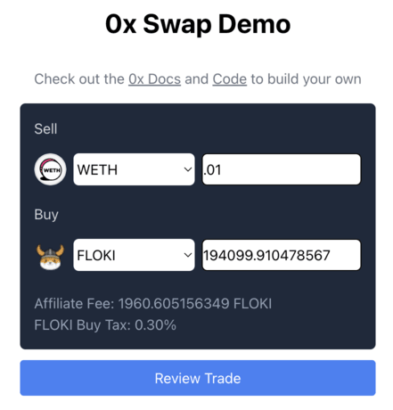
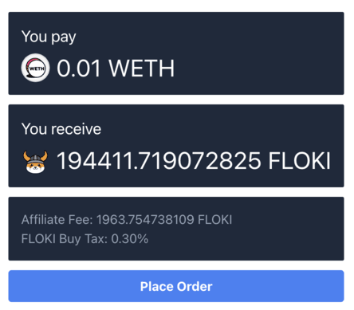

# CryptoSwap
Add commentMore actions
A beautiful, modern, and minimal decentralized crypto swap interface built with Next.js, RainbowKit, Wagmi, and the 0x Swap API. Easily connect your wallet, get real-time swap quotes, and swap tokens with a smooth user experience and full dark/light mode support.



---

## ✨ Features

- **Wallet Connect**: Connect with MetaMask, Phantom, Coinbase Wallet, WalletConnect, Trust Wallet, and more (RainbowKit).
- **Token Selector**: Choose from a dynamic or hardcoded token list (WETH, USDC, DAI, etc.).
- **Live Quote**: Fetches real-time swap quotes from the 0x API as you type.
- **Swap Animation**: Smooth, modern swap animation for a delightful UX.
- **ERC20 Approval**: Handles token approvals automatically before swap.
- **Dark/Light Mode**: Toggle and persist your preferred theme.
- **Responsive Design**: Works beautifully on desktop and mobile.
- **Custom Modals**: Enhanced wallet and chain modals for a premium feel.

---

## 🚀 Getting Started

### 1. **Clone the Repo**
```powershell
# Using PowerShell
git clone https://github.com/yourusername/cryptoswap.git
cd cryptoswap
```

### 2. **Install Dependencies**
```powershell
pnpm install
```

### 3. **Set Up Environment**
- Copy `.env.example` to `.env.local` and fill in your `NEXT_PUBLIC_WALLET_CONNECT_PROJECT_ID` (get one from [WalletConnect Cloud](https://cloud.walletconnect.com/)).

### 4. **Run the App**
```powershell
pnpm dev
```
Visit [http://localhost:3000](http://localhost:3000) in your browser.

---

## 🛠️ Tech Stack
- **Next.js 14** (App Router)
- **TypeScript**
- **Tailwind CSS**
- **RainbowKit** & **Wagmi** (Wallet connection)
- **0x Swap API** (Quotes & swaps)
- **Viem** (EVM utilities)

---

## 📸 Screenshots
| Swap View | Quote View |
|-----------|------------|
|  |  |

---

## 📚 Learn More
- [0x Swap API Docs](https://docs.0x.org/0x-api-swap/api-references/get-swap-v1-quote)
- [RainbowKit Docs](https://www.rainbowkit.com/docs/introduction)
- [Wagmi Docs](https://wagmi.sh/docs/getting-started)
- [WalletConnect Cloud](https://cloud.walletconnect.com/)
- [What is a Crypto Wallet? (YouTube)](https://www.youtube.com/watch?v=Af_lQ1zUnoM)

---

## 🤝 Contributing
Pull requests are welcome! For major changes, please open an issue first to discuss what you would like to change.

---

## 📝 License
MIT

---

## 💡 Credits
- UI inspired by modern DeFi apps.
- Built by [Pratik](https://github.com/yourusername).
